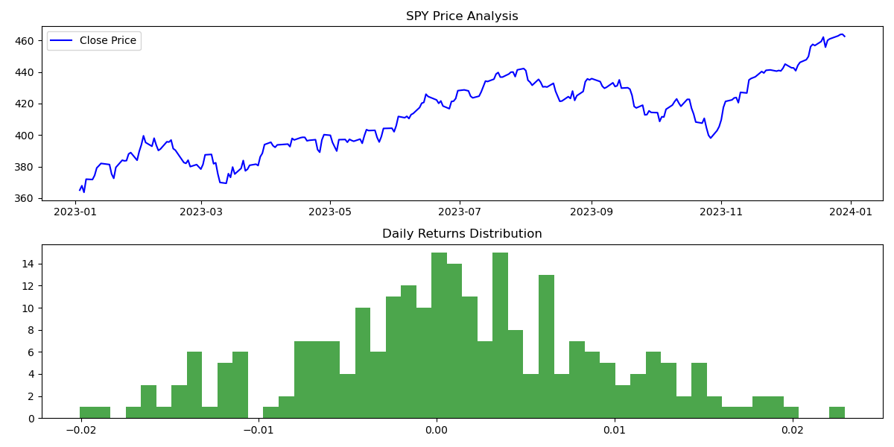

# Quantitative Financial Risk Analysis: S&P 500

<div align="center">
  
  
  
  
</div>

## 📌 Project Overview
This project performs an Exploratory Data Analysis (EDA) and quantitative risk assessment on the S&P 500 Index (SPY ETF). It demonstrates the end-to-end process of fetching real-world financial data via APIs, calculating critical risk metrics, and visualizing the results. 

This serves as a foundational step for building more complex Machine Learning-based algorithmic trading or risk management systems.

## 📊 Key Features
* **Automated Data Ingestion:** Utilizes the `yfinance` API to reliably extract adjusted historical market data, handling real-world data structure updates.
* **Return Volatility Analysis:** Calculates and visualizes the distribution of daily returns, a core component for modeling asset volatility and normal distribution assumptions in ML models.
* **Risk Assessment (Max Drawdown):** Implements the calculation of Maximum Drawdown to quantify the peak-to-trough decline, a crucial metric for evaluating portfolio risk exposure.

## 📈 Visualizing Market Behavior
*(The chart below visualizes the adjusted close price trend and the distribution of daily returns, highlighting market volatility.)*

<div align="center">
  
</div>

## 🚀 Technical Implementation

### Prerequisites
To run this script locally, ensure you have Python installed along with the required libraries:

```bash
pip install yfinance pandas matplotlib
Core Logic Snippet
The analysis calculates the maximum drawdown by tracking the cumulative maximum price and identifying the deepest trough:
# Calculate Max Drawdown
rolling_max = data['Close'].cummax()
drawdown = (data['Close'] - rolling_max) / rolling_max
max_drawdown = drawdown.min()
🔮 Future Enhancements (Machine Learning Roadmap)
As a FinTech enthusiast focusing on Machine Learning, future iterations of this repository will explore:

Time-Series Forecasting: Implementing ARIMA or LSTM models to predict short-term price movements based on historical volatility.

Sentiment Analysis Integration: Incorporating NLP techniques to analyze financial news and correlate sentiment scores with daily returns.

Automated Backtesting System: Building a robust framework to test algorithmic trading strategies based on the identified risk metrics.

Disclaimer: This project is for educational purposes only and does not constitute financial advice.
